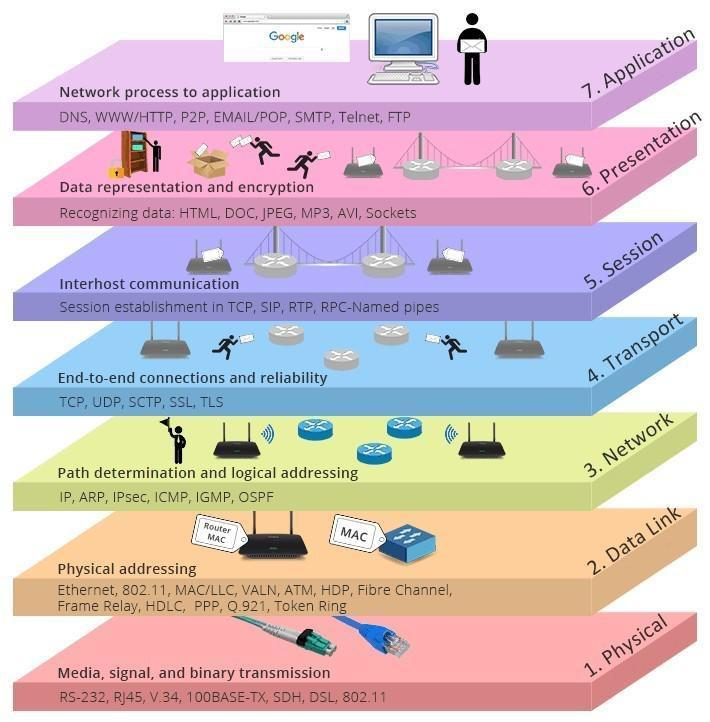
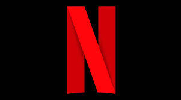

# Reto Experto de la semana #1

## Autores: Jean Chachalo, Ivonne Aguilar, Angelica Perez

### Repositorio de estudio con los conceptos aprendidos a lo largo de la semana

#### PaaS, IaaS, SaaS

Los 3 son distintas capas de prestaciones de servicios en la nube, en orden de responsabilidades/permisos por parte de los usuarios se encuentran:
- IasS
- PaaS
- SaaS

**Infrastructure as a Service**

> La infraestructura como servicio (IaaS) es un servicio de computación en nube en el que las empresas alquilan o arriendan servidores para el cálculo y el almacenamiento en la nube.

[Infraestructura como Servicio - Microsoft](https://azure.microsoft.com/es-es/overview/what-is-iaas/)

Aqui se compran o alquilan recursos de cómputo altamente escalables y automatizados a pedido y según sea necesario, lo que les permite canjear los gastos de capital por gastos variables. Pagan sobre la marcha y solo por lo que usan.

**Platform as a Service**

[Plataforma como Servicio - Microsoft](https://azure.microsoft.com/es-es/overview/what-is-paas/)

> La Plataforma como servicio (PaaS) es una modalidad del cloud computing en la cual un tercero brinda el sistema de hardware y una plataforma de software de aplicaciones.

PaaS les brinda a los desarrolladores una variedad de formas de desarrollar, personalizar, administrar y dar soporte a su software y aplicaciones.

**Software as a Service**

[Software como Servicio - Microsoft](https://azure.microsoft.com/es-es/overview/what-is-saas/)

> El software como servicio (SaaS) ofrece a los usuarios la posibilidad de conectarse a aplicaciones alojadas en la nube a través de Internet. También poder operar con ellas sin la necesidad del apoyo de sistemas cliente.

En el modelo SaaS, el navegador web del cliente actúa como el punto de acceso al software y las aplicaciones que se ejecutan en servidores de terceros (es decir, infraestructura). El software es implementado, administrado, actualizado y soportado por un tercero también.

# Capas del modelo OSI

Se trata de un modelo basado en 7 capas con distintas funciones y en conjunto definen un estándar de comunicación en donde hardware y diferentes protocolos puedan interactuar.

## Niveles OSI orientados a red 
Se trata del apartado físico de la conexión
1. Física: Define el medio físico de transmisión (Cables)

2. Enlace de datos: Medios para establecer la comunicación de los elementos físicos

3. Red: Identificación del enrutamiento entre redes conectadas

4. Transporte: Transporte de los datos de origen a distino

## Niveles OSI orientados a aplicación

5. Sesión: Controla y mantiene el enlace entre las máquinas que están transmitiendo información

6. Presentación: Representación de la información transmitida

7. Aplicación: Permitir a los usuarios ejecutar acciones y comandos en sus propias aplicaciones

# NETFLIX CON AWS

> A Netflix lo que mejor se le daba era proporcionar vídeos a sus suscriptores, por ello  decidió concentrarse en mejorar el servicio de entregas en lugar de mejorar la creación de centros de datos, añadido a esto el bajo coste de la nube, pues esta solamente agrega servidores cuando se necesitan y se devuelven cuando no son usados, esto se traduce a: Netflix solo tiene que pagar por lo que necesita y cuando sea necesario.
Además AWS ofrece bases de datos, almacenamiento y centros de datos de mucha confianza. Y para garantizar el alto rendimiento de Netflix, este utiliza AWS en tres regiones: dos en Estados Unidos y una en Irlanda. Dentro de cada región, Netflix opera en tres zonas de disponibilidad diferentes.
¿Pero qué sucede si se cae toda la región de Irlanda?, Netflix te redirige a una de las regiones de Estados Unidos y tu dispositivo pasará a transmitir información a esa región en vez de la de Irlanda. Ni siquiera te darías cuenta de que se ha caído una parte del sistema. Brindando además una cobertura mundial.

### NETFLIX: CLIENTES, BACKEND Y RED DE ENTREGA DE CONTENIDOS
•   El cliente: es la interfaz de usuario en cualquier dispositivo utilizado para navegar y reproducir vídeos de Netflix.
•   Servidor backend: todo lo que sucede antes de que le des al botón de play ocurre en este servidor y se ejecuta en el AWS. Esto incluye cosas como preparar todo el nuevo vídeo entrante y gestionar las solicitudes de todas las aplicaciones. 
•   Todo lo que sucede después de presionar play es gestionado por la red de entrega de contenidos, esto a nivel global y de forma personalizada. También  almacena y transmite videos de Netflix en diferentes lugares del mundo llegando así a tu dispositivo.
Al controlar las tres áreas (cliente, servidor backend y red de entrega de contenidos), Netflix ha conseguido obtener una integración vertical completa.

### TRASCODIFICACION DE CONTENIDO
> Trascodificacion =formato de video idóneo para cada dispositivo.
Lo primero que hace Netflix es pasar mucho tiempo validando el vídeo, Si se encuentra algún problema, se descarta el vídeo.
Una vez que se ha validado el vídeo, se introduce en el canal de datos, que es simplemente una serie de pasos para procesar los datos. No es muy conveniente procesar un archivo de varios terabytes, por lo que la primera acción es dividir el vídeo en trozos más pequeños, despues pasan al canal de datos para que puedan ser codificados en paralelo, es decir, al mismo tiempo.
Eso es el paralelismo y la razón por la que Netflix utiliza tantos servidores en EC2. Una vez que se han codificado los trozos de vídeo, son validados para asegurarse de que no han surgido nuevos problemas. Después se vuelven a juntar las piezas en un solo archivo y se vuelve a validar.
El proceso de codificación crea muchos archivos, ya que el objetivo final de Netflix es admitir cualquier dispositivo con conexión a Internet.

[Leer mas](https://www.xataka.com/streaming/la-compleja-infraestructura-detras-de-netflix-que-pasa-cuando-le-das-al-play#:~:text=En%20realidad%2C%20Netflix%20usa%20dos,tengan%20problemas%20con%20el%20streaming.)

### ¿QUE OCURRE ANTES DE DAR PLAY? 

> Todo lo que no tenga que ver con la transmisión de vídeo se lleva a cabo en AWS, esto incluye computación escalable, almacenamiento escalable, lógica empresarial, bases de datos descentralizadas escalables, procesamiento y análisis de big data, recomendaciones, transcodificación, etc.
[Leer mas](https://www.xataka.com/streaming/la-compleja-infraestructura-detras-de-netflix-que-pasa-cuando-le-das-al-play#:~:text=En%20realidad%2C%20Netflix%20usa%20dos,tengan%20problemas%20con%20el%20streaming.)

-Reto realizado por : Jean Chachalo, Ivonne Aguilar, Angelica Perez